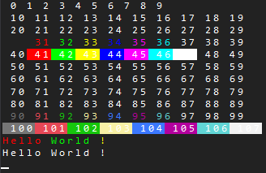
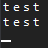

# terminal
terminal creates a functional terminal which can read escape sequences
some C functions like printf() and putchar()

read the documentation https://github.com/flamebousteur/terminal/wiki/doc

example:
```js
import { terminal } from './terminal.js';
const term = new terminal(document.querySelector('terminal'), 30, 30);

for (let i = 0; i < 11; i++) {
	for (let j = 0; j < 10; j++) {
		let n = 10 * i + j;
		if (n > 107) break;
		term.puts("\x1b["+n+"m "+n+"\x1b[0m");
	}
	term.puts("\n");
}

term.puts("\x1b[1;31mHello\x1b[m \x1b[1;32mWorld\x1b[m \x1b[1;33m!\x1b[0m\n");
term.printf("%s %s %s\n", "Hello", "World", "!");
```




input example:
```js
import { terminal , input } from './terminal.js';
const term = new terminal(document.querySelector('terminal'), 30, 30);
const inp = new input(term);

inp.onkey = function (e){/* key pressed */}
inp.onsend = function (msg){
	term.puts(msg+"\n");
}
```

